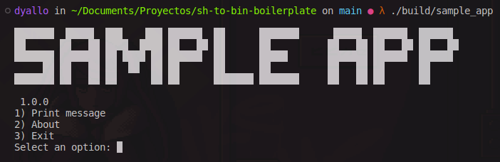

# SH TO BIN Boilerplpate 📦



This repository is a boilerplate on how create your own binaries from shell scripts. Using shc, you can compile your shell scripts into binaries.

Logo from `http://www.patorjk.com/software/taag/#p=display&f=ANSI%20Regular&t=Sample%20App`

## Requirements 📋

- [shc](https://github.com/neurobin/shc)
- bash

## Build 📦

There is a makefile rule to build the binary.

```bash
make
```

## Execute 🔢

There is a makefile rule to execute the binary.

```bash
make execute
```

Once complete you can move the binary to `/usr/local/bin` to make it available system wide.

```bash
sudo mv build/sample_app /usr/local/bin
```

## Explanation on how add funcionality ➕

You can write functions with bash or write node/python scripts and call them from the main script.

To understand how to make a python or node script callable from the main script, you can check the `weather` and `dolar` functions.

Also read from `https://en.wikipedia.org/wiki/Shebang_%28Unix%29` to understand how to make a script executable.

To understand how the select works, you can read from `https://linuxize.com/post/bash-select/`

```bash
PS3='Select an option: ' 

# Add more options here
options=("Print message" "Weather" "Dolar" "Exit")

# Add your functions here
select opt in "${options[@]}"
do
    case $opt in
        "Print message")
            first
            break
            ;;
        "Weather")
            weather
            break
            ;;
        "Dolar")
            dolar
            break
            ;;
        "Exit")
            stop_app
            break
            ;;
        *) echo -e "Invalid option";;
    esac
done
```
